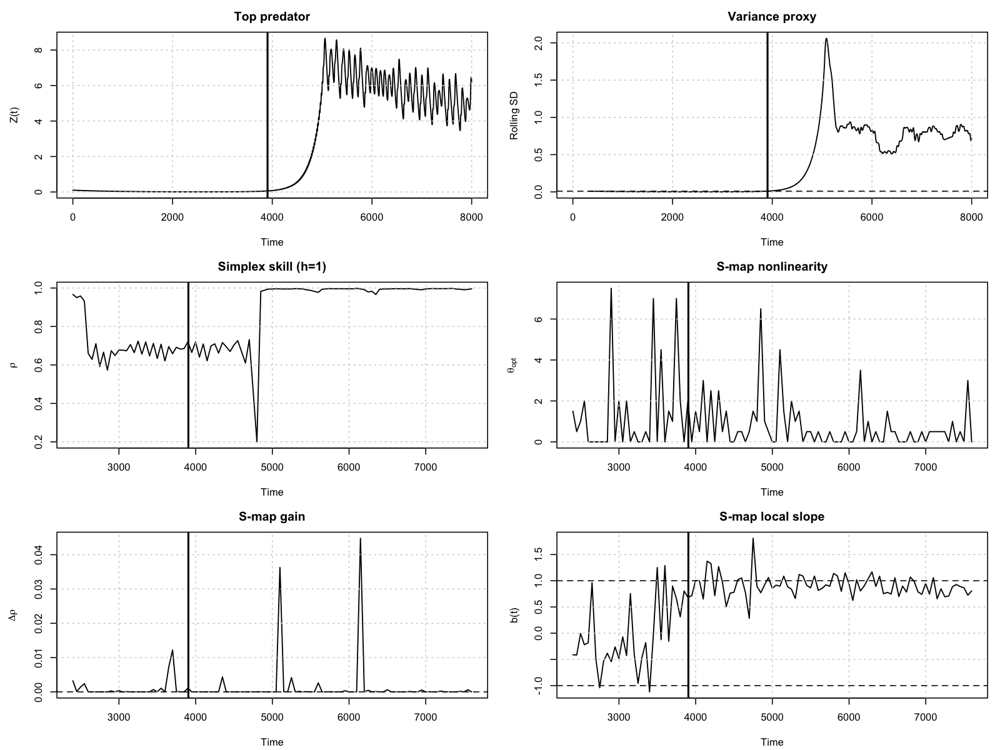

# Nonlinear Dynamical Systems — Scientific Machine Learning & Regime Shifts

Research-grade computational studies of **nonlinear dynamical systems** focused on:

- Stability and attractor structure  
- Predictability limits (chaos, noise, sensitivity)  
- Regime behavior and critical transitions  
- Equation-based simulation combined with data-driven analysis  

This repository is **methods-first**: each study is organized around transferable tools for simulation, parameter sweeps, stability diagnostics, and regime-shift detection.

---

## Start Here (Flagship Project)

If you only look at one thing in this repository, start with the flagship study:

### **Tri-Trophic Regime Shifts and Early-Warning Detection**
📁 `ecology/tritrophic-early-warning/`

This project implements an **end-to-end, reproducible pipeline** to:

- Simulate nonlinear tri-trophic population dynamics
- Analyze attractor geometry and long-run behavior
- Quantify predictability collapse approaching regime transitions
- Evaluate early-warning indicators directly from time series (equation-free)

### Quickstart (Reproduce One Main Result)

```bash
git clone https://github.com/OussamaNajar/nonlinear-dynamical-systems.git
cd nonlinear-dynamical-systems/ecology/tritrophic-early-warning
Rscript scripts/run_pipeline.R
```

**Runtime:** ~3-4 minutes  
**Dependencies:** R (≥4.1) + `deSolve` package only

### Key Results (Summary)

- **Predictability horizon collapses** as the system approaches a regime transition
- **Early-warning indicators rise consistently** prior to critical transitions across parameter sweeps
- Results are **robust to noise and perturbations** within tested regimes



➡️ **Full technical documentation, assumptions, and reproduction details:**  
[ecology/tritrophic-early-warning/README.md](ecology/tritrophic-early-warning/README.md)

---

## Why This Matters

Many real systems — ecosystems, markets, climate, engineered control loops — share the same fundamental difficulties:

- Nonlinear feedback produces multi-regime behavior
- Prediction skill degrades sharply beyond a horizon
- Regime change dominates error more than model misspecification
- Better curve-fitting does not imply greater predictability

This repository is built to answer a concrete question:

**What aspects of a nonlinear system are structurally predictable, what are not, and why?**

---

## Repository Structure

```
nonlinear-dynamical-systems/
├── ecology/
│   └── tritrophic-early-warning/
│       ├── README.md        # full technical documentation
│       ├── scripts/         # runnable analysis entrypoints
│       ├── R/               # modular functions
│       ├── results/         # generated outputs
│       ├── figures/         # generated plots
│       └── paper/           # manuscript-quality writeup
```

Each study directory is self-contained and includes:

- Runnable code (`R/`, `src/`, or `scripts/`)
- Generated outputs and figures
- Explicit reproduction instructions
- Documented assumptions and interpretation

---

## Featured Study: Tri-Trophic Ecological Dynamics

**Hastings–Powell Family**

A computational study of nonlinear tri-trophic food-chain models emphasizing:

- Attractor geometry and long-run dynamics
- Parameter sensitivity and regime transitions
- Predictability limits under perturbations
- Interpretation in a management/decision-making context

---

## Reproducibility

All figures and results are generated from code. No manual post-processing is required.

Each study directory contains its own `README.md` with:

- Environment requirements
- Step-by-step execution instructions
- Expected outputs and diagnostics

---

## Notes for Reviewers and Recruiters

This repository is organized to reflect **research and modeling workflows**, not coursework.

Emphasis is placed on **stability, predictability, and failure modes**, not just fitting accuracy.

The flagship project demonstrates the full pipeline from **simulation → diagnostics → interpretation**.

**For a technical deep dive, start with:**  
[ecology/tritrophic-early-warning/README.md](ecology/tritrophic-early-warning/README.md)
